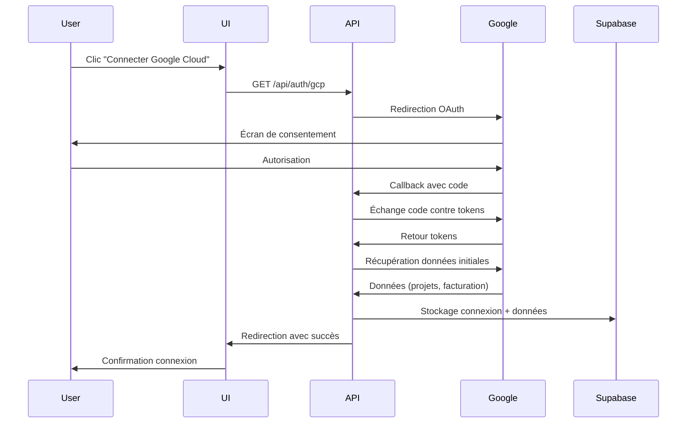

# Google Cloud Platform OAuth Integration - Setup Guide

Cette documentation explique comment configurer et utiliser l'intégration OAuth complète avec Google Cloud Platform dans GreenOps AI.

## 🚀 Vue d'ensemble

L'intégration OAuth GCP permet aux utilisateurs de :
- Se connecter à leur compte Google Cloud via OAuth 2.0
- Récupérer automatiquement les données de facturation et de coûts
- Synchroniser les projets et comptes de facturation
- Gérer les connexions directement depuis l'interface

## 📋 Prérequis

### 1. Configuration Google Cloud Console

1. **Créer un projet GCP** (si pas déjà fait)
   - Aller sur [Google Cloud Console](https://console.cloud.google.com/)
   - Créer un nouveau projet ou sélectionner un projet existant

2. **Activer les APIs nécessaires**
   ```bash
   # APIs à activer :
   - Cloud Billing API
   - Cloud Resource Manager API
   - BigQuery API (pour les données de facturation)
   - Cloud Monitoring API
   ```

3. **Configurer OAuth 2.0**
   - Aller dans "APIs & Services" > "Credentials"
   - Cliquer "Create Credentials" > "OAuth 2.0 Client IDs"
   - Type d'application : "Web application"
   - Origines JavaScript autorisées :
     ```
     http://localhost:3000
     https://votre-domaine.com
     ```
   - URIs de redirection autorisés :
     ```
     http://localhost:3000/api/auth/gcp/callback
     https://votre-domaine.com/api/auth/gcp/callback
     ```

4. **Configurer l'écran de consentement OAuth**
   - Aller dans "APIs & Services" > "OAuth consent screen"
   - Configurer les informations de l'application
   - Ajouter les scopes nécessaires :
     - `https://www.googleapis.com/auth/cloud-billing`
     - `https://www.googleapis.com/auth/cloud-billing.readonly`
     - `https://www.googleapis.com/auth/bigquery.readonly`
     - `https://www.googleapis.com/auth/monitoring.read`

### 2. Configuration des variables d'environnement

Ajouter dans votre fichier `.env.local` :

```env
# Google OAuth Configuration
GOOGLE_CLIENT_ID=your-google-client-id
GOOGLE_CLIENT_SECRET=your-google-client-secret

# NextAuth Configuration
NEXTAUTH_URL=http://localhost:3000
NEXTAUTH_SECRET=your-nextauth-secret

# Supabase Configuration
NEXT_PUBLIC_SUPABASE_URL=your-supabase-url
SUPABASE_SERVICE_ROLE_KEY=your-supabase-service-role-key

# Encryption Key for OAuth tokens
ENCRYPTION_KEY=your-32-character-encryption-key
```

### 3. Configuration de la base de données Supabase

1. **Exécuter le schéma SQL**
   ```sql
   -- Exécuter le contenu du fichier database/gcp-oauth-schema.sql
   -- dans votre console Supabase SQL Editor
   ```

2. **Vérifier les tables créées**
   - `gcp_connections` : Stocke les connexions OAuth
   - `gcp_billing_data` : Stocke les données de facturation

## 🔧 Architecture technique

### Composants principaux

1. **Client OAuth (`src/lib/gcp/oauth-client.ts`)**
   - Gère le flux OAuth 2.0
   - Chiffrement/déchiffrement des tokens
   - Rafraîchissement automatique des tokens

2. **Service de données (`src/services/GCPDataFetcher.ts`)**
   - Récupération des données GCP
   - Gestion des APIs Google Cloud
   - Traitement des données de facturation

3. **Composant UI (`src/components/gcp/GCPConnectButton.tsx`)**
   - Interface utilisateur pour la connexion
   - Gestion des états (connecté/déconnecté/erreur)
   - Feedback utilisateur en temps réel

4. **Endpoints API**
   - `/api/auth/gcp` : Initiation OAuth
   - `/api/auth/gcp/callback` : Callback OAuth
   - `/api/gcp/connection-status` : Statut de connexion
   - `/api/gcp/disconnect` : Déconnexion
   - `/api/gcp/refresh` : Actualisation des données

### Flux OAuth complet



## 🎯 Utilisation

### 1. Intégration dans une page

```tsx
import { GCPConnectButton } from '@/src/components/gcp/GCPConnectButton';

function MyPage() {
  return (
    <GCPConnectButton 
      onConnectionChange={(status) => {
        console.log('GCP connection status:', status);
      }}
      showStatus={true}
      variant="default"
    />
  );
}
```

### 2. Récupération des données

```tsx
import { useSupabaseData } from '@/hooks/useSupabase';

function MyComponent() {
  const { getGCPConnectionStatus, getGCPBillingData } = useSupabaseData();
  
  const checkConnection = async () => {
    const status = await getGCPConnectionStatus(userId);
    if (status?.connection_status === 'connected') {
      const billingData = await getGCPBillingData(userId);
      console.log('Billing data:', billingData);
    }
  };
}
```

## 📊 Données récupérées

### Connexion initiale
- ✅ **Comptes de facturation** : Liste des comptes accessibles
- ✅ **Projets** : Tous les projets liés aux comptes de facturation
- ✅ **Données de coûts** : Facturation des 30 derniers jours
- ✅ **Services actifs** : Services utilisés par projet
- ✅ **Budgets** : Budgets configurés (si accessibles)
- ✅ **Métadonnées** : Informations du compte utilisateur

### Actualisation périodique
- 🔄 **Synchronisation automatique** des données
- 🔄 **Rafraîchissement des tokens** avant expiration
- 🔄 **Mise à jour des coûts** et métriques

## 🔐 Sécurité

### Chiffrement des tokens
- Tous les tokens OAuth sont chiffrés avec AES-256-GCM
- Clé de chiffrement stockée dans les variables d'environnement
- Tokens automatiquement rafraîchis avant expiration

### Permissions minimales
- Accès en lecture seule aux données de facturation
- Pas d'accès aux ressources de calcul
- Révocation possible des tokens à tout moment

### Row Level Security (RLS)
- Politiques Supabase pour isoler les données par utilisateur
- Aucun accès croisé entre les comptes utilisateurs

## 🐛 Dépannage

### Erreurs courantes

1. **"OAuth initiation failed"**
   - Vérifier les variables d'environnement `GOOGLE_CLIENT_ID` et `GOOGLE_CLIENT_SECRET`
   - Vérifier les URIs de redirection dans Google Cloud Console

2. **"Token refresh failed"**
   - L'utilisateur doit se reconnecter
   - Vérifier que le refresh token est valide

3. **"Failed to fetch GCP data"**
   - Vérifier que les APIs nécessaires sont activées
   - Vérifier les permissions du compte utilisateur

4. **"Storage failed"**
   - Vérifier la configuration Supabase
   - Vérifier que les tables existent

### Logs de débogage

Les logs détaillés sont disponibles dans :
- Console du navigateur (côté client)
- Logs Vercel/serveur (côté API)
- Logs Supabase (base de données)

## 🚀 Déploiement

### Variables d'environnement de production

```env
# Production Google OAuth
GOOGLE_CLIENT_ID=prod-google-client-id
GOOGLE_CLIENT_SECRET=prod-google-client-secret

# Production URLs
NEXTAUTH_URL=https://votre-domaine.com
NEXTAUTH_SECRET=production-secret-key

# Production Supabase
NEXT_PUBLIC_SUPABASE_URL=https://your-project.supabase.co
SUPABASE_SERVICE_ROLE_KEY=your-production-service-role-key

# Production Encryption
ENCRYPTION_KEY=your-production-32-char-key
```

### Checklist de déploiement

- [ ] Variables d'environnement configurées
- [ ] URIs de redirection OAuth mis à jour
- [ ] Schéma de base de données déployé
- [ ] APIs Google Cloud activées
- [ ] Tests de connexion effectués
- [ ] Monitoring des erreurs configuré

## 📈 Monitoring

### Métriques à surveiller
- Taux de succès des connexions OAuth
- Temps de réponse des APIs Google
- Erreurs de synchronisation des données
- Utilisation du stockage Supabase

### Alertes recommandées
- Échec de rafraîchissement des tokens > 5%
- Temps de réponse API > 10 secondes
- Erreurs de stockage > 1%

## 🔄 Maintenance

### Tâches périodiques
- Nettoyage des données de facturation anciennes (>90 jours)
- Vérification de l'expiration des tokens
- Mise à jour des scopes OAuth si nécessaire
- Surveillance des quotas Google Cloud APIs

### Fonction de nettoyage automatique
```sql
-- Exécuter mensuellement
SELECT public.cleanup_old_gcp_billing_data();
```

## 📞 Support

Pour toute question ou problème :
1. Consulter les logs d'erreur
2. Vérifier la configuration OAuth
3. Tester avec un compte de développement
4. Consulter la documentation Google Cloud

---

**Note** : Cette intégration respecte les meilleures pratiques de sécurité et les guidelines OAuth 2.0 de Google. Tous les tokens sont chiffrés et les données utilisateur sont protégées par des politiques RLS strictes.
